# Kantin Kita

Aplikasi manajemen kantin kampus berbasis web & desktop. Mahasiswa bisa pesan makanan online, vendor mengelola menu & pesanan, dan admin mengelola seluruh platform.

---

## Tech Stack

| Sub-proyek | Teknologi |
|---|---|
| **Backend API** | Spring Boot 4.0.6, Java 21, MySQL, JPA/Hibernate |
| **Frontend Web** | Next.js 16, React 19, TypeScript, Tailwind CSS 4, shadcn/ui |
| **Admin Desktop** | Java Swing, FlatLaf, Gson |
| **Vendor Desktop** | Java Swing, FlatLaf, Gson |

**Dependencies utama backend:** Spring Security (JWT), Xendit (payment gateway), OpenAPI/Swagger, Lombok

---

## Fitur

### User (Mahasiswa)
- Register & login (NIM)
- Lihat daftar resto, cari menu
- Atur metode pesan (Dine In / Pickup)
- Checkout & bayar via Xendit
- Riwayat pesanan
- Rating & review

### Vendor
- Kelola profil kedai (jam operasional, buka/tutup)
- CRUD menu + kustomisasi (varian, level, catatan)
- Kelola pesanan masuk (Proses → Siap → Selesai)
- Lihat analytics (pendapatan, menu terlaris, tren)
- Lihat ulasan

### Admin
- Dashboard (total resto, vendor, user, pendapatan)
- CRUD: Restoran, Vendor, Kategori, Lokasi, Banner, Voucher
- Upload gambar menu/banner

---

## Arsitektur

```
┌─────────────────────────────────────────────────────┐
│                   Frontend Web                       │
│          (Next.js - Consumer App)                    │
└──────────────────┬──────────────────────────────────┘
                   │ HTTP / JSON
                   ▼
┌─────────────────────────────────────────────────────┐
│              Backend REST API                        │
│     (Spring Boot - Java 21 - MySQL)                  │
└──────┬──────────────────────────────┬───────────────┘
       │ HTTP / JSON                  │ HTTP / JSON
       ▼                              ▼
┌──────────────┐           ┌──────────────────┐
│ Admin Desktop │           │ Vendor Desktop   │
│ (Java Swing)  │           │ (Java Swing)     │
└──────────────┘           └──────────────────┘
```

---

## Alur Aplikasi

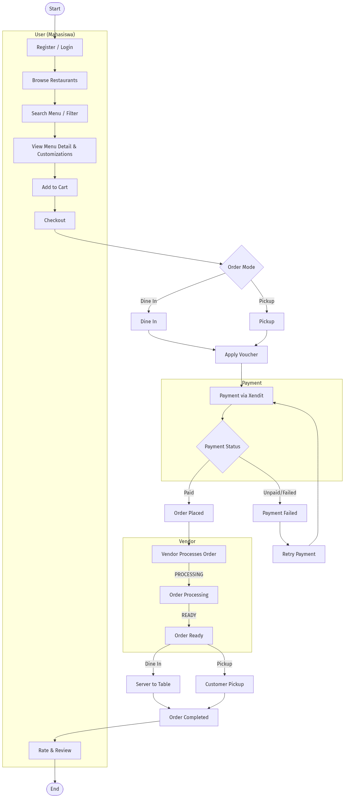

---

## Entity Relationship Diagram

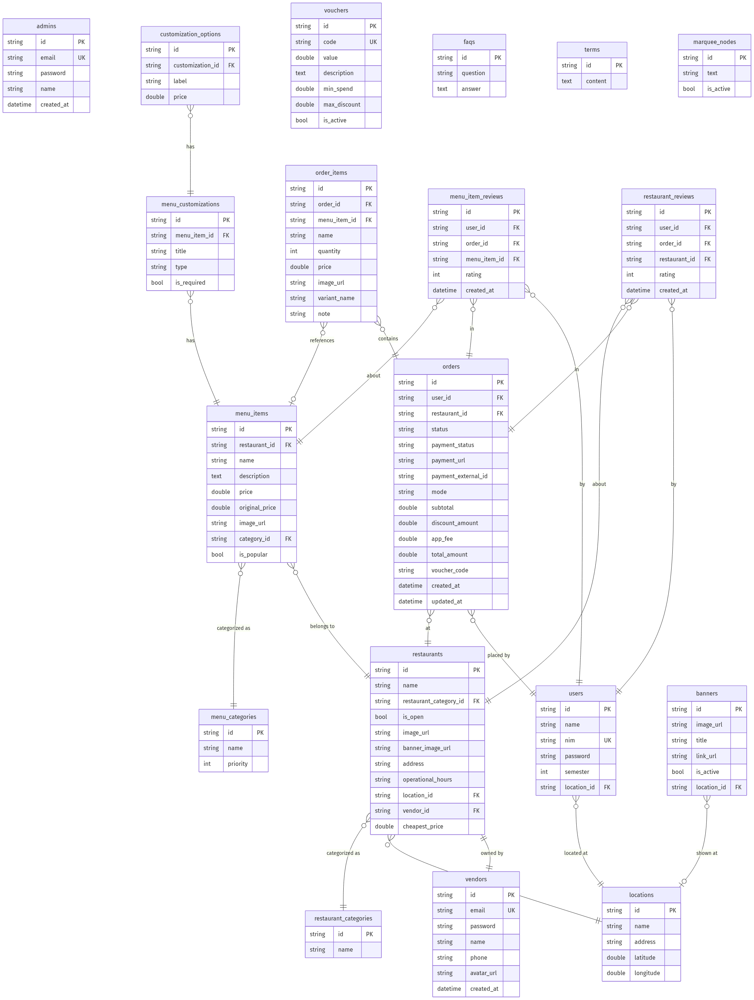

---

## Use Case Diagram

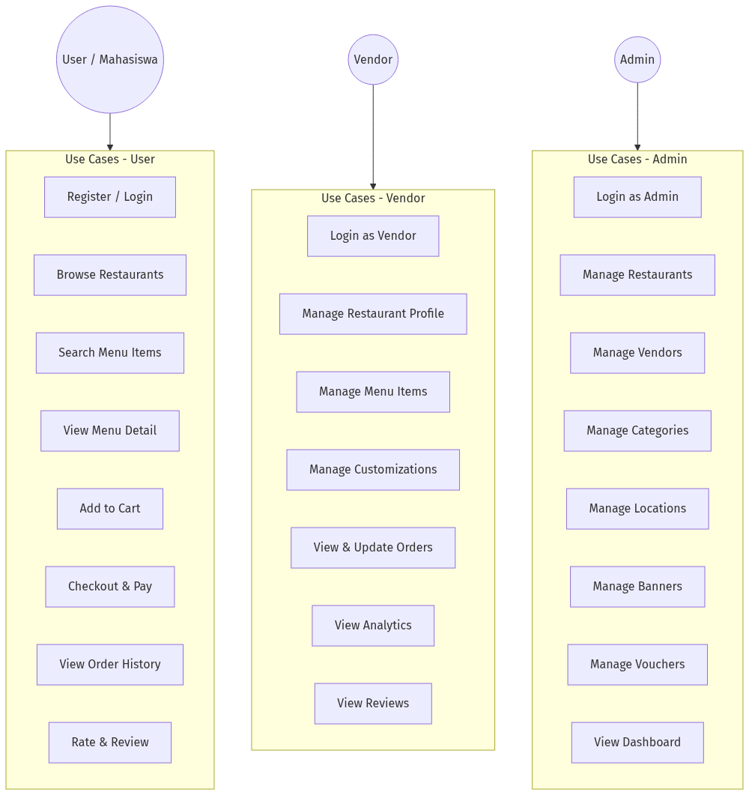

---

## Prerequisites

| Tool | Versi |
|---|---|
| Java JDK | 21 |
| Maven | 3.9+ |
| Node.js | 20+ |
| MySQL | 8+ |
| Git | - |

---

## Cara Install & Jalankan

### 1. Clone & Setup Database

```bash
git clone https://github.com/yourusername/kantin-kita.git
cd kantin-kita
```

Buat database MySQL:
```sql
CREATE DATABASE kantin_kita;
```

### 2. Backend API

```bash
cd backend
cp .env.example .env    # Isi konfigurasi database
mvn clean install
mvn spring-boot:run
```

API berjalan di `http://localhost:8080`.  
Swagger UI: `http://localhost:8080/swagger-ui.html`

### 3. Frontend Web

```bash
cd frontend
cp .env.example .env    # Isi NEXT_PUBLIC_API_URL
npm install
npm run dev
```

Berjalan di `http://localhost:3000`

### 4. Admin Desktop

```bash
cd frontend-admin
mvn clean package
java -jar target/frontend-admin-1.0-SNAPSHOT.jar
```

### 5. Vendor Desktop

```bash
cd frontend-kantin
mvn clean package
java -jar target/frontend-kantin-1.0-SNAPSHOT.jar
```

---

## Environment Variables

### Backend (`backend/.env`)

| Variable | Default | Keterangan |
|---|---|---|
| `DB_URL` | `jdbc:mysql://localhost:3306/kantin_kita` | URL database |
| `DB_USERNAME` | `root` | User MySQL |
| `DB_PASSWORD` | - | Password MySQL |
| `APP_JWT_SECRET` | - | Secret key JWT (min 256-bit) |
| `APP_JWT_EXPIRATION_MS` | `86400000` | Masa berlaku token (24 jam) |
| `XENDIT_SECRET_KEY` | - | Secret key Xendit |
| `XENDIT_CALLBACK_TOKEN` | - | Callback verification token |
| `APP_UPLOAD_DIR` | `uploads` | Folder upload gambar |

### Frontend Web (`frontend/.env`)

| Variable | Default | Keterangan |
|---|---|---|
| `NEXT_PUBLIC_API_URL` | `http://localhost:8080/api/v1` | Base URL backend API |

---

## API Documentation

Dokumentasi API lengkap (OpenAPI/Swagger) tersedia setelah backend berjalan:

```
http://localhost:8080/swagger-ui.html
http://localhost:8080/v3/api-docs
```

### Endpoint Utama

| Method | Endpoint | Role |
|---|---|---|
| POST | `/api/v1/auth/login` | Public |
| POST | `/api/v1/auth/register` | Public |
| GET | `/api/v1/restaurants` | Authenticated |
| GET | `/api/v1/restaurants/{id}` | Authenticated |
| POST | `/api/v1/orders` | Authenticated |
| GET | `/api/v1/orders` | Authenticated |
| POST | `/api/v1/payments/callback` | Public (Xendit callback) |
| POST | `/api/v1/vendor/auth/login` | Public |
| GET | `/api/v1/vendor/restaurants/{id}` | Vendor |
| POST | `/api/v1/admin/auth/login` | Public |
| GET | `/api/v1/admin/dashboard/summary` | Admin |

---

## Screenshots

### Admin Desktop

| | |
|---|---|
| 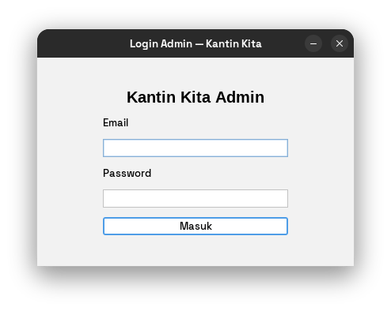 | 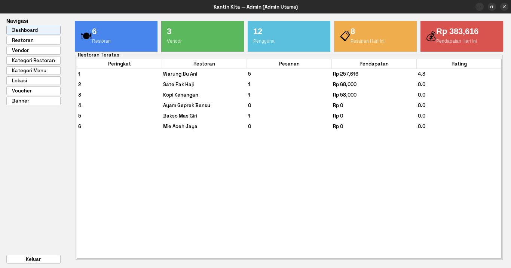 |
| 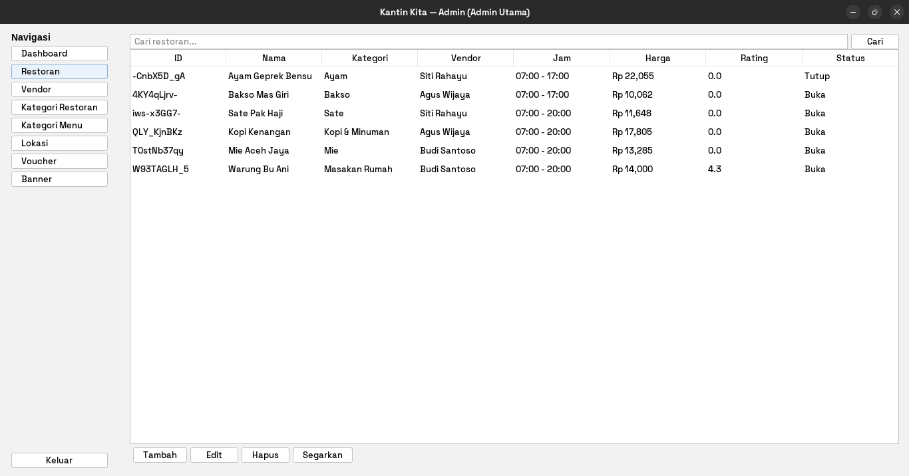 | 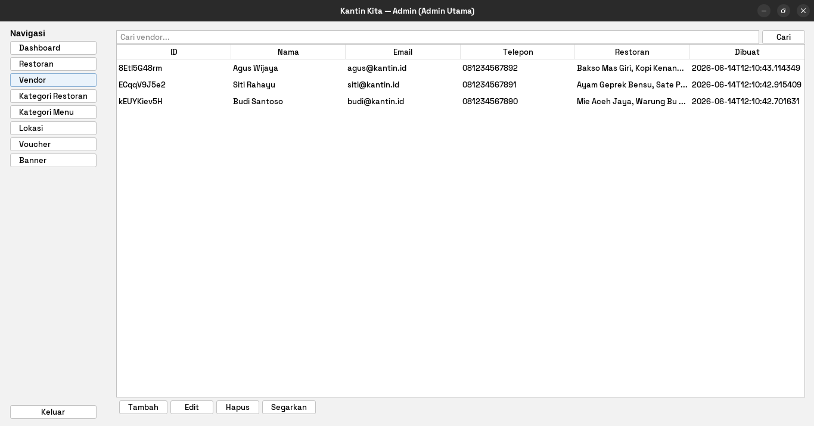 |
| 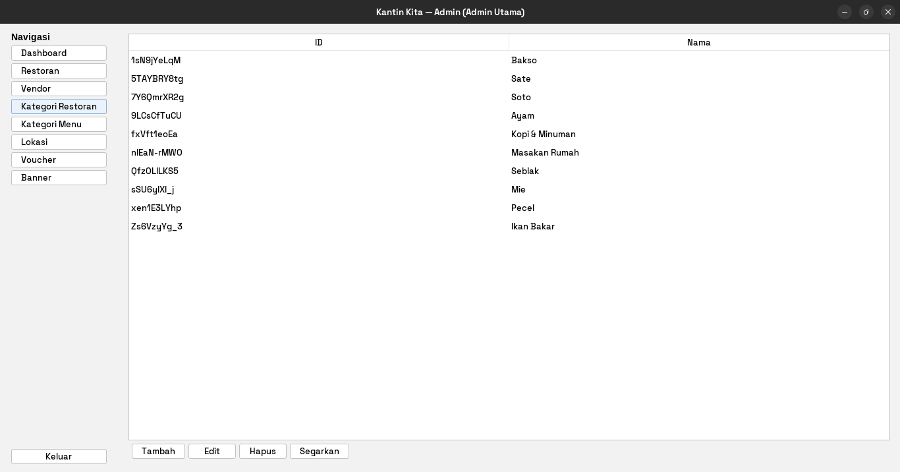 | 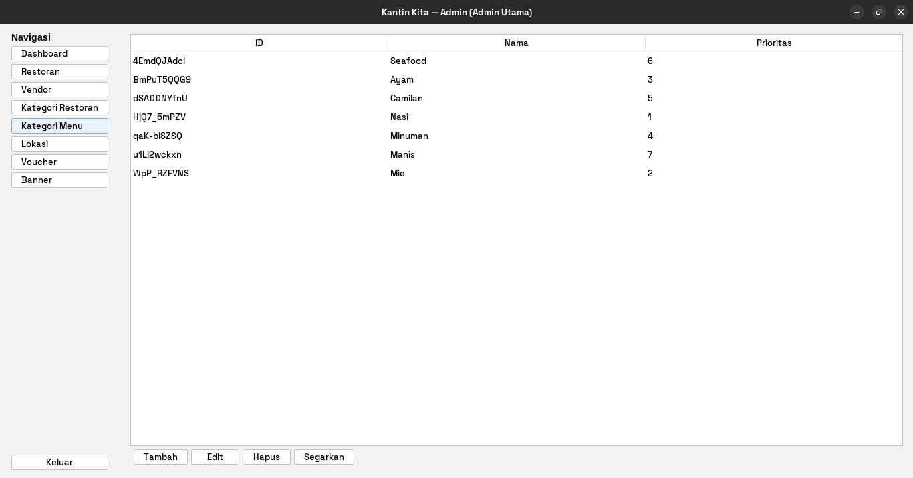 |
| 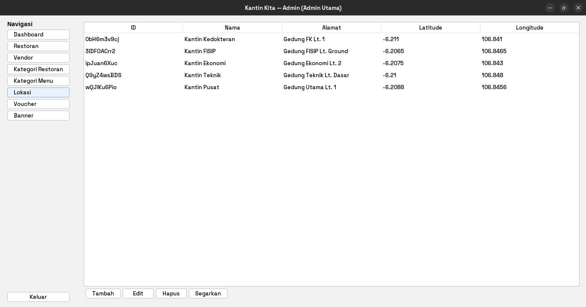 | 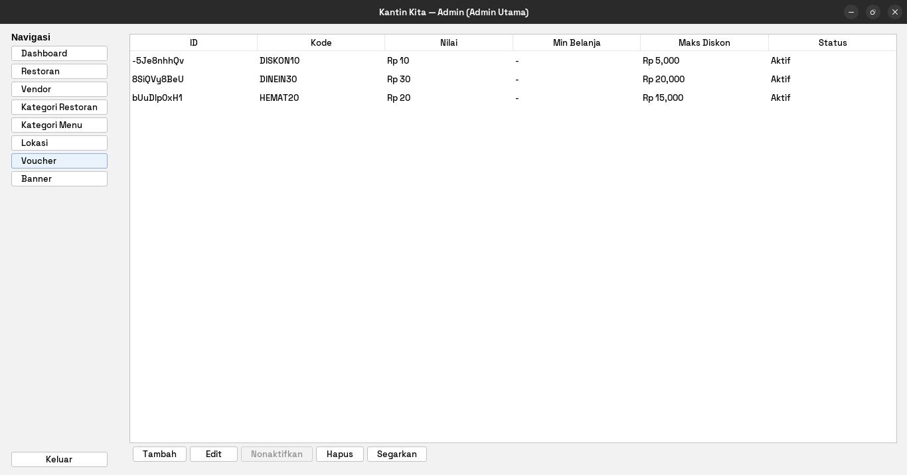 |
| 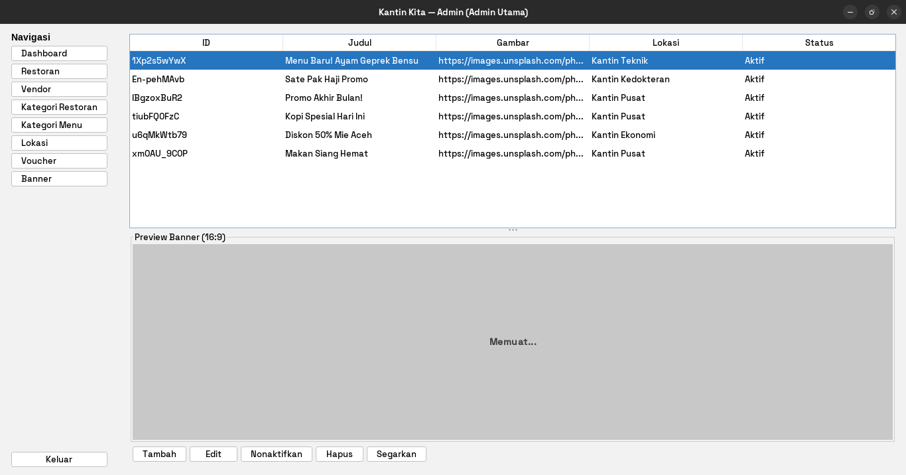 | |

### Vendor Desktop

| | |
|---|---|
| 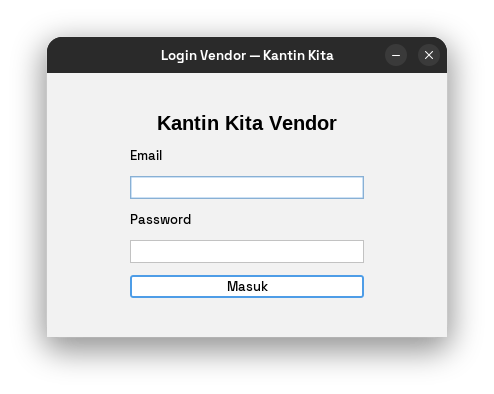 | 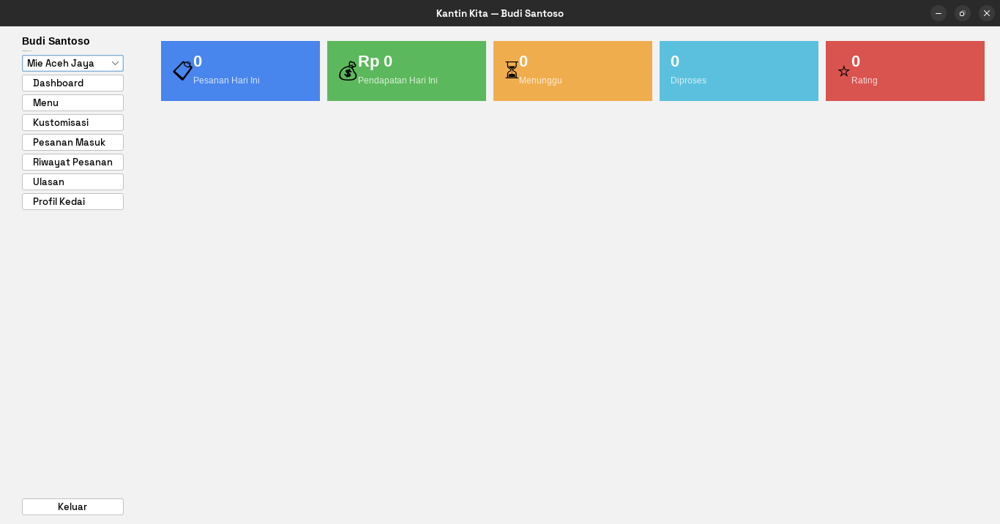 |
| 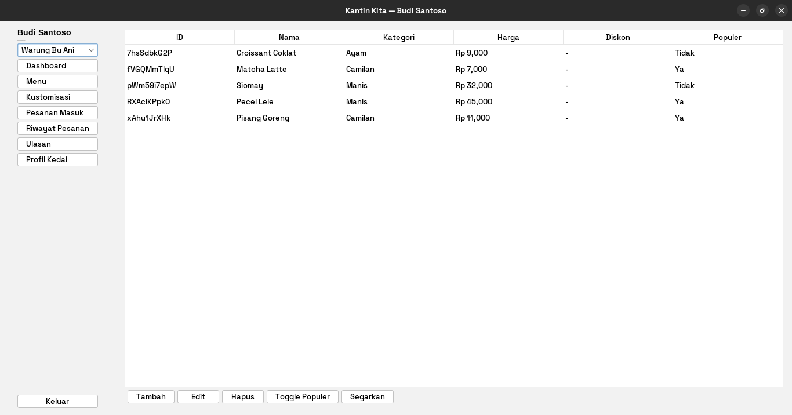 | 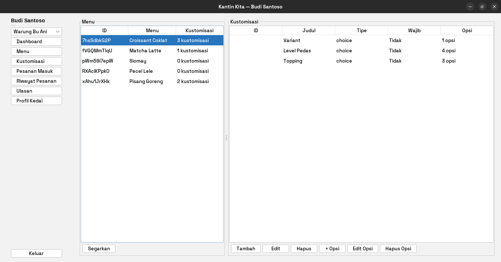 |
| 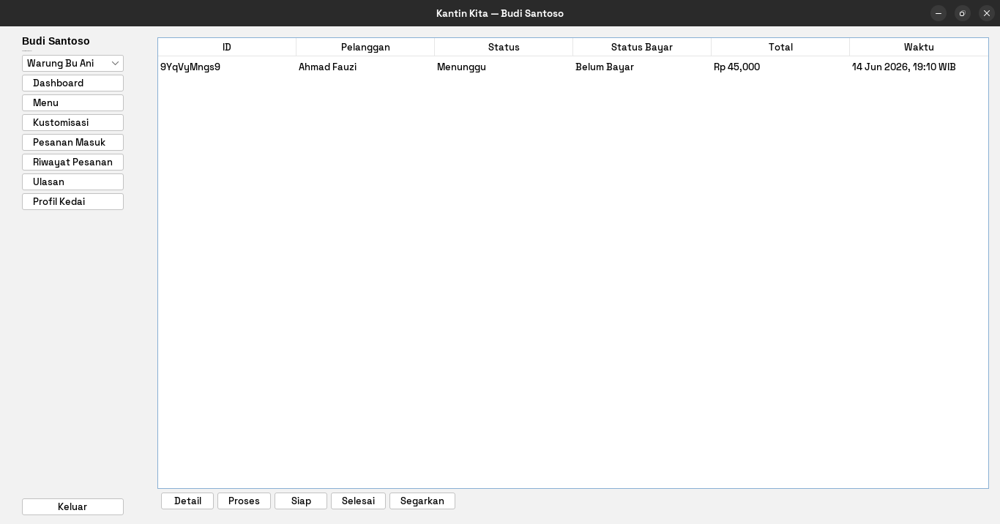 | 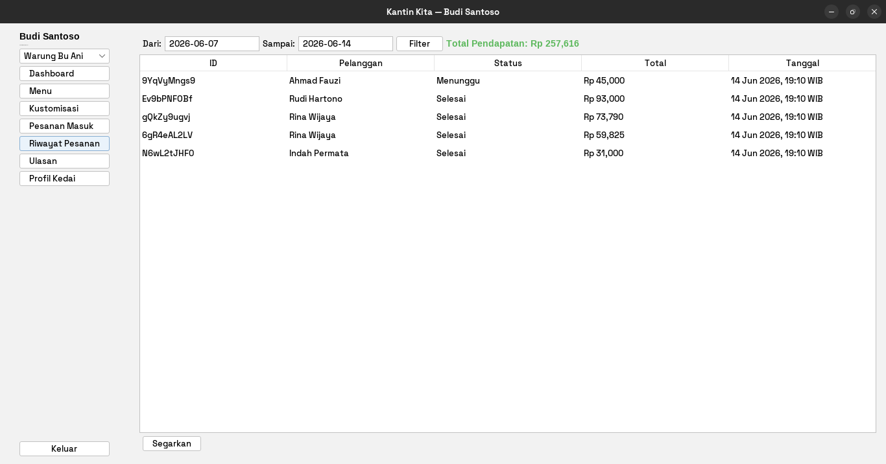 |
| 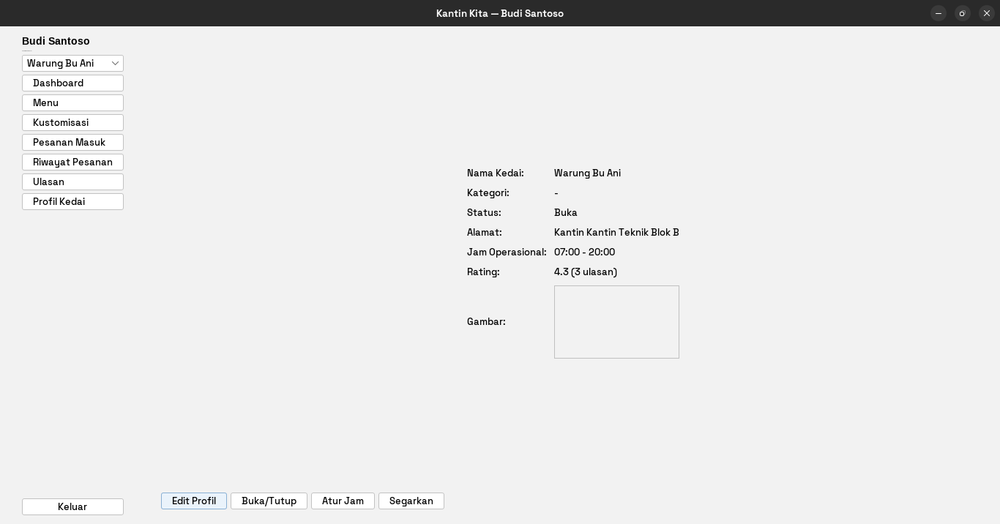 | 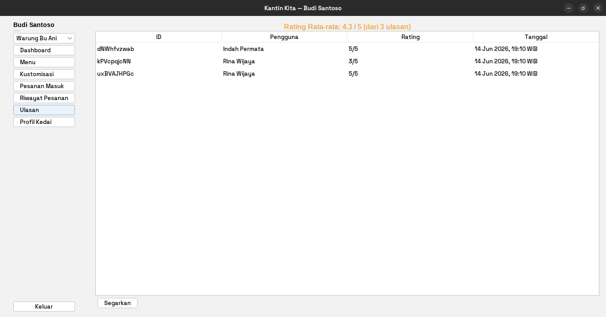 |

### User Web

> *(coming soon)*
