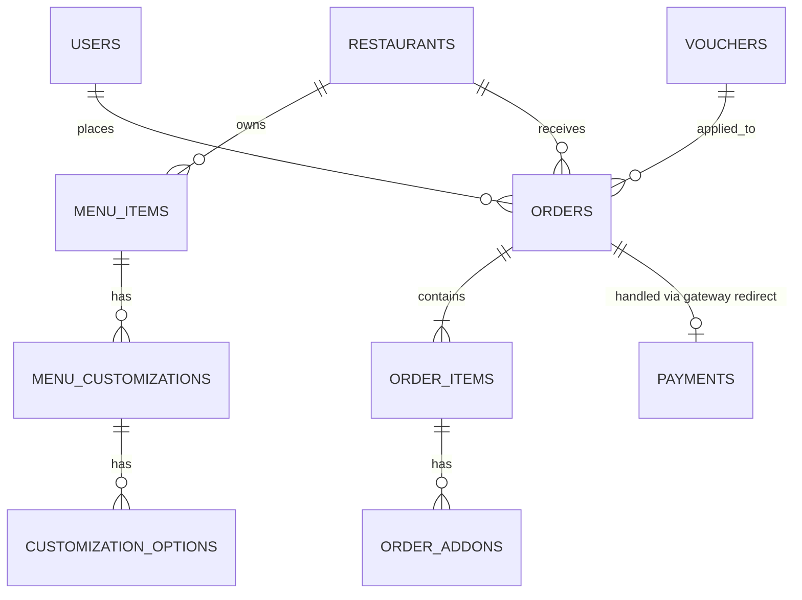

# Backend Product Requirements Document (PRD) - Kantin Kita

## 1. Project Overview
**Kantin Kita** adalah aplikasi pemesanan makanan khusus lingkungan kantin (internal campus/office) yang mengutamakan kecepatan dan kemudahan transaksi bagi pengguna (mahasiswa/karyawan) dan pemilik stan (vendor).

---

## 2. Technology Stack
- **Language**: Java 21
- **Framework**: Spring Boot 3.3+
- **Database**: PostgreSQL (Relational Data) & Redis (Session/Caching)
- **Authentication**: JWT (Stateless)
- **Documentation**: Swagger/OpenAPI 3.0
- **Build Tool**: Maven

---

## 3. Entity Relationship Diagram (ERD)

### 3.1. User Management
- **Users**: 
    - `id` (UUID, PK)
    - `name` (String)
    - `nim` (String, Unique) - Identitas pengguna
    - `password` (String, Hashed)
    - `avatar_url` (String)
    - `location_id` (FK) - Lokasi terpilih (Kantin Pusat, Kantin Teknik, dll)
    - `semester` (Integer)
    - `role` (Enum: USER, ADMIN, VENDOR)

### 3.2. Master Data (Discovery)
- **Locations**: `id`, `name`, `address`, `latitude`, `longitude`.
- **Banners**: `id`, `image_url`, `title`, `link_url`, `is_active`, `location_id` (FK).
- **Categories**: `id`, `name`, `priority`.
- **MarqueeNodes**: `id`, `text`, `is_active`.
- **FAQs**: `id`, `question`, `answer`.
- **Terms**: `id`, `title`, `content` (Markdown).

### 3.3. Restaurant & Menu
- **Restaurants**:
    - `id` (UUID, PK)
    - `name`, `cuisine`, `rating`, `image_url`, `banner_image_url`, `address`, `operational_hours`
    - `location_id` (FK) - Restoran terikat pada lokasi tertentu
    - `is_open` (Boolean)
- **MenuItems**:
    - `id` (UUID, PK)
    - `restaurant_id` (FK)
    - `name`, `description`, `price`, `image_url`, `category_name`, `rating`, `sales_count`
    - `is_popular` (Boolean)
- **MenuCustomizations**: 
    - `id`, `menu_item_id` (FK), `title`, `type` (CHOICE, MULTIPLE), `is_required`.
- **CustomizationOptions**: 
    - `id`, `customization_id` (FK), `label`, `price`.

### 3.4. Vouchers & Orders
- **Vouchers**: 
    - `id`, `code` (Unique), `value` (Percentage), `max_discount`, `min_spend`, `is_active`.
- **Orders**:
    - `id` (UUID, PK)
    - `user_id` (FK), `restaurant_id` (FK)
    - `order_number` (String) - Contoh: #1234
    - `status` (Enum: PENDING, PROCESSING, READY, COMPLETED, CANCELLED)
    - `payment_status` (Enum: UNPAID, PAID, EXPIRED, FAILED)
    - `payment_url` (String) - Redirect URL ke Payment Gateway
    - `payment_external_id` (String) - ID referensi dari Payment Gateway
    - `mode` (Enum: DINE_IN, PICKUP)
    - `subtotal`, `discount_amount`, `app_fee`, `total_amount`
    - `created_at`, `updated_at`
- **OrderItems**: 
    - `id`, `order_id` (FK), `menu_item_id` (FK), `name`, `quantity`, `price`, `variant_name`, `note`.
- **OrderAddons**: 
    - `id`, `order_item_id` (FK), `name`, `price`.

---

## 4. API Endpoints Specification (REST)

### 4.1. Authentication
- `POST /api/v1/auth/login`: Login dengan NIM/Email & Password -> Return JWT & UserProfile.
- `POST /api/v1/auth/register`: Pendaftaran pengguna baru.
- `GET /api/v1/auth/me`: Get current user info (location, etc).

### 4.2. Discovery & Settings
- `GET /api/v1/locations`: List lokasi kantin yang tersedia.
- `GET /api/v1/banners`: List banner promo aktif (filter berdasarkan lokasi user).
- `GET /api/v1/categories`: List kategori makanan.
- `GET /api/v1/marquee`: List pengumuman teks berjalan.
- `GET /api/v1/faqs`: List tanya-jawab.
- `GET /api/v1/terms`: Get ketentuan layanan (Markdown).

### 4.3. Restaurants & Search
- `GET /api/v1/restaurants`: 
  - Params: `block` (Filter lokasi), `search` (Nama restorans).
- `GET /api/v1/restaurants/{id}`: Detail restoran + daftar Menu per kategori.
- `GET /api/v1/menus/search`: Global search menu items.
  - Params: `q` (keyword).

### 4.4. Vouchers
- `GET /api/v1/vouchers`: List voucher yang tersedia untuk user.
- `POST /api/v1/vouchers/validate`: Cek validitas kode voucher terhadap subtotal keranjang.

### 4.5. Orders & Payments (Core Logic)
- `POST /api/v1/orders`: Buat pesanan baru.
    - **Logic**: Create Order & Items -> Generate Payment URL (PG Integration) -> Return `order_id` & `payment_url`.
- `POST /api/v1/payments/callback`: Webhook handle notifikasi dari Payment Gateway (Midtrans/Xendit/dll).
    - **Logic**: Verifikasi signature -> Update `payment_status` -> Jika PAID, update `status` order ke PROCESSING.
- `GET /api/v1/orders`: Riwayat pesanan user (Sorted by newest).
- `GET /api/v1/orders/{id}`: Detail status pesanan & status pembayaran.

---

## 5. Main Business Flows

### 5.1. Alur Transaksi (Checkout)
1. **Frontend**: Mengirim data keranjang (`items`, `mode`, `voucher_code`).
2. **Backend**:
    - Validasi apakah stok/menu tersedia.
    - Jika ada voucher, hitung potongan harga.
    - Simpan `Orders` dengan status `PENDING` dan `payment_status` `UNPAID`.
    - Request ke Payment Gateway API untuk mendapatkan `payment_url`.
    - Simpan `payment_url` dan `external_id` ke database.
    - Kembalikan response berisi `payment_url` ke Frontend.
3. **Frontend**: Redirect user ke `payment_url`.
4. **Backend (Webhook)**: 
    - Menerima notifikasi dari Payment Gateway.
    - Update `payment_status` menjadi `PAID`.
    - Update `status` order menjadi `PROCESSING`.
    - Kirim notifikasi ke Vendor/Stan.

### 5.2. Alur Lokasi & Tenant
1. User memilih lokasi di awal aplikasi.
2. Seluruh data (Banner, Restoran, Promo) yang dikembalikan API akan otomatis terfilter berdasarkan `location_id` tersebut.

---

## 6. Security Requirements
1. **Password Hashing**: Menggunakan BCrypt.
2. **Authorization**:
    - User hanya bisa melihat order miliknya sendiri.
    - Vendor hanya bisa melihat order yang masuk ke stan mereka.
3. **Validation**: Seluruh input jumlah/harga harus divalidasi di sisi server (jangan percaya client-side calculation).

---

## 7. Database Diagram (Mermaid)

