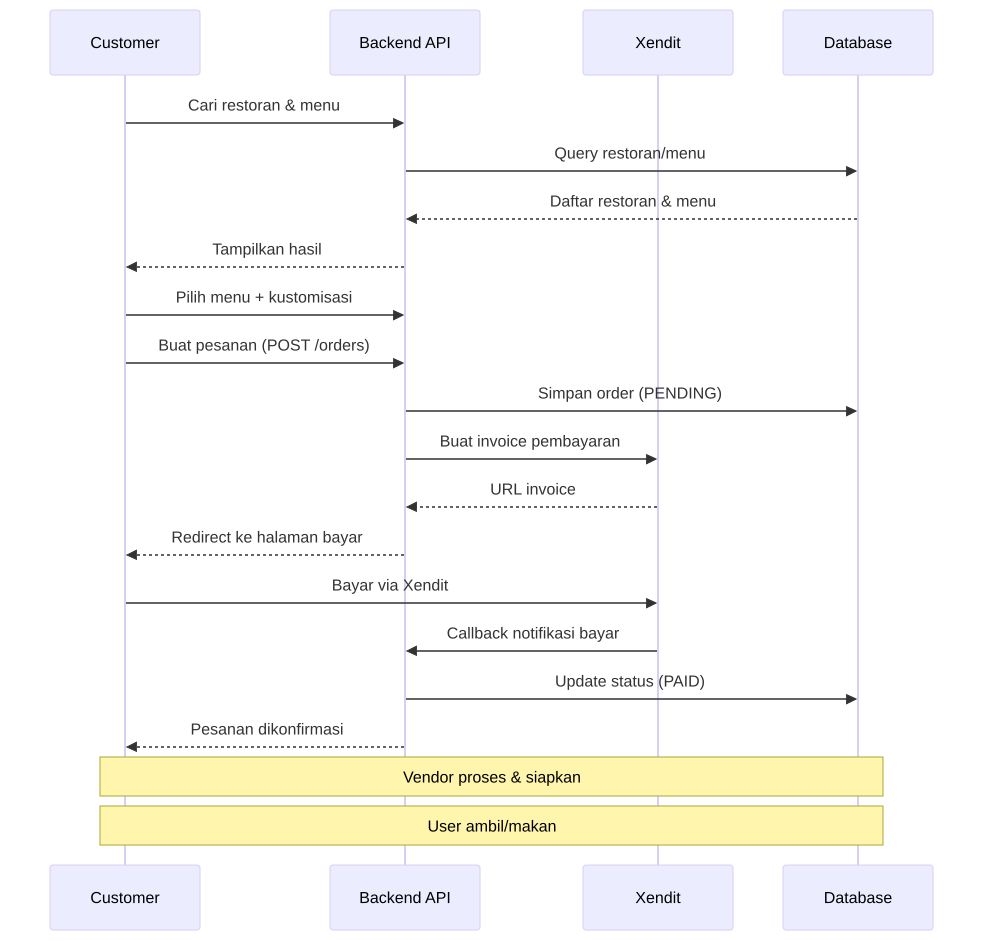
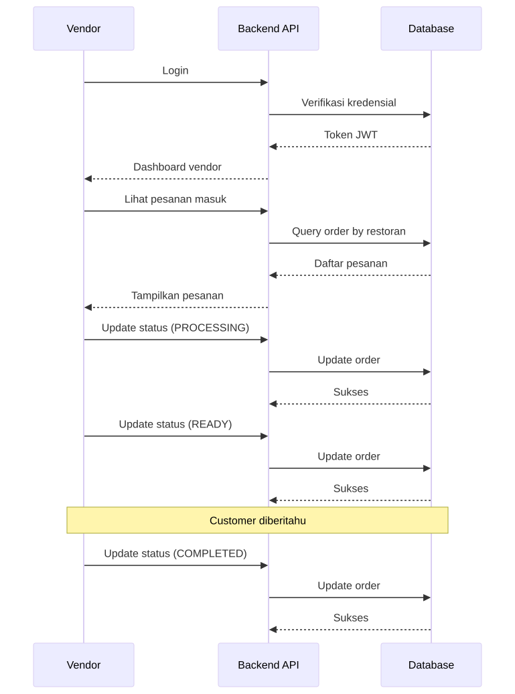

# Buku Manual Backend Kantin Kita

**Stack:** Java 21, Spring Boot 4, MySQL, Spring Security (JWT), Xendit Payment

---

## 1. Pendahuluan

Kantin Kita adalah backend untuk aplikasi pemesanan makanan kantin kampus. Melayani dua peran: **Customer** (mahasiswa) yang bisa cari menu, pesan, bayar, dan review; serta **Vendor** (penjual) yang mengelola restoran, menu, pesanan, dan lihat dashboard.

**Tech Stack:**
- Java 21 + Spring Boot 4.0.6
- MySQL (production), H2 (testing)
- Spring Data JPA / Hibernate
- Spring Security + JWT (jjwt 0.12.6)
- Xendit Payment Gateway
- NanoID (10 karakter) untuk primary key
- Swagger UI (OpenAPI)

---

## 2. Arsitektur & Alur Aplikasi

### 2.1 Alur Customer (Pemesanan Makanan)



**Garis besar:** User cari restoran/menu → pilih & buat pesanan → bayar via Xendit → vendor proses → selesai.

### 2.2 Alur Vendor (Manajemen Pesanan)



**Garis besar:** Vendor login → lihat pesanan masuk → proses → ready → completed.

### 2.3 Struktur Package

```
com.example.demo
├── controller/   # 21 controller REST
├── service/      # 21 service class
├── repository/   # 18 JPA repository
├── entity/       # 18 entity + 4 enum
├── dto/          # request/response DTO
├── config/       # security, JWT, exception handler, dll
└── seed/         # data seeder
```

Setiap request mengalir: **Controller → Service → Repository → Database**, response kembali lewat DTO.

---

## 3. Entity Relationship Diagram (ERD)



**Daftar Entitas (18):**

| # | Entitas | Tabel | Deskripsi |
|---|---------|-------|-----------|
| 1 | User | `users` | Mahasiswa |
| 2 | Vendor | `vendors` | Pemilik kantin |
| 3 | Location | `locations` | Lokasi kantin |
| 4 | Restaurant | `restaurants` | Restoran/stall |
| 5 | MenuItem | `menu_items` | Item makanan |
| 6 | Category | `categories` | Kategori makanan |
| 7 | MenuCustomization | `menu_customizations` | Grup kustomisasi (CHOICE/MULTIPLE) |
| 8 | CustomizationOption | `customization_options` | Opsi kustomisasi |
| 9 | Order | `orders` | Pesanan |
| 10 | OrderItem | `order_items` | Item dalam pesanan |

| 12 | Banner | `banners` | Banner promosi |
| 13 | Voucher | `vouchers` | Voucher diskon |
| 14 | MenuItemReview | `menu_item_reviews` | Review menu |
| 15 | RestaurantReview | `restaurant_reviews` | Review restoran |
| 16 | MarqueeNode | `marquee_nodes` | Teks pengumuman |
| 17 | FAQ | `faqs` | FAQ |
| 18 | Term | `terms` | Syarat & ketentuan |

Semua primary key menggunakan **NanoID** (10 karakter) sebagai pengganti auto-increment.

---

## 4. API Endpoints

### 4.1 Public Endpoints (Tanpa Auth)

| Method | Endpoint | Deskripsi |
|--------|----------|-----------|
| POST | `/api/v1/auth/register` | Register user baru |
| POST | `/api/v1/auth/login` | Login user |
| POST | `/api/v1/payments/callback` | Webhook Xendit |
| GET | `/api/v1/promos` | Daftar promo |

### 4.2 Customer Endpoints (Auth Required)

| Method | Endpoint | Deskripsi |
|--------|----------|-----------|
| GET | `/api/v1/auth/me` | Profile user |
| GET | `/api/v1/restaurants` | List restoran (filter lokasi) |
| GET | `/api/v1/restaurants/{id}` | Detail restoran + menu |
| GET | `/api/v1/menus/search` | Cari menu global |
| POST | `/api/v1/orders` | Buat pesanan |
| GET | `/api/v1/orders` | Riwayat pesanan user |
| GET | `/api/v1/orders/{id}` | Detail pesanan |
| GET | `/api/v1/orders/unreviewed` | Pesanan tanpa review |
| GET | `/api/v1/banners` | Banner aktif |
| GET | `/api/v1/categories` | Kategori makanan |
| GET | `/api/v1/locations` | Semua lokasi |
| GET | `/api/v1/locations/nearest` | Lokasi terdekat |
| GET | `/api/v1/vouchers` | Voucher aktif |
| POST | `/api/v1/vouchers/validate` | Validasi voucher |
| POST | `/api/v1/menu-item-reviews` | Review item menu |
| GET | `/api/v1/menu-item-reviews/menu-item/{id}` | Review suatu menu |
| POST | `/api/v1/restaurant-reviews` | Review restoran |
| GET | `/api/v1/restaurant-reviews/restaurant/{id}` | Review suatu restoran |
| GET | `/api/v1/restaurant-reviews/check` | Cek sudah review? |
| GET | `/api/v1/terms` | Syarat & ketentuan |
| GET | `/api/v1/faqs` | FAQ |
| GET | `/api/v1/marquee` | Teks pengumuman |

### 4.3 Vendor Endpoints (Role VENDOR)

| Method | Endpoint | Deskripsi |
|--------|----------|-----------|
| POST | `/api/v1/vendor/auth/login` | Login vendor |
| GET | `/api/v1/vendor/auth/me` | Profile vendor |
| GET | `/api/v1/vendor/restaurants/{id}` | Detail restoran |
| PUT | `/api/v1/vendor/restaurants/{id}` | Update restoran |
| PATCH | `/api/v1/vendor/restaurants/{id}/status` | Buka/tutup restoran |
| PUT | `/api/v1/vendor/restaurants/{id}/hours` | Update jam operasional |
| GET | `/api/v1/vendor/restaurants/{id}/menus` | List menu |
| POST | `/api/v1/vendor/restaurants/{id}/menus` | Tambah menu |
| PUT | `/api/v1/vendor/menus/{menuId}` | Update menu |
| DELETE | `/api/v1/vendor/menus/{menuId}` | Hapus menu |
| PATCH | `/api/v1/vendor/menus/{menuId}/popular` | Toggle popular |
| POST | `/api/v1/vendor/menus/{menuId}/customizations` | Tambah grup kustomisasi |
| PUT | `/api/v1/vendor/customizations/{id}` | Update grup kustomisasi |
| DELETE | `/api/v1/vendor/customizations/{id}` | Hapus grup kustomisasi |
| POST | `/api/v1/vendor/customizations/{id}/options` | Tambah opsi kustomisasi |
| PUT | `/api/v1/vendor/customization-options/{id}` | Update opsi |
| DELETE | `/api/v1/vendor/customization-options/{id}` | Hapus opsi |
| GET | `/api/v1/vendor/restaurants/{id}/orders` | List pesanan masuk |
| GET | `/api/v1/vendor/orders/{orderId}` | Detail pesanan |
| PATCH | `/api/v1/vendor/orders/{orderId}/status` | Update status pesanan |
| GET | `/api/v1/vendor/restaurants/{id}/reviews` | Review restoran |
| GET | `/api/v1/vendor/restaurants/{id}/analytics/summary` | Ringkasan dashboard |
| GET | `/api/v1/vendor/restaurants/{id}/analytics/revenue` | Data pendapatan |
| GET | `/api/v1/vendor/restaurants/{id}/analytics/top-items` | Menu terlaris |
| GET | `/api/v1/vendor/restaurants/{id}/analytics/orders` | Tren pesanan |

### 4.4 Status Order

| Status | Keterangan |
|--------|------------|
| PENDING | Menunggu pembayaran |
| PROCESSING | Dibayar, sedang diproses vendor |
| READY | Siap diambil |
| COMPLETED | Selesai |
| CANCELLED | Dibatalkan |

### 4.5 Status Pembayaran

| Status | Keterangan |
|--------|------------|
| UNPAID | Belum dibayar |
| PAID | Sudah dibayar |
| EXPIRED | Kadaluwarsa |
| FAILED | Gagal |

---

## 5. Cara Menjalankan

**Prasyarat:** Java 21+, MySQL 8+, Maven 3.9+

```bash
# 1. Setup database
mysql -u root -p -e "CREATE DATABASE kantin_kita;"
cp .env.example .env   # lalu edit konfigurasi database

# 2. Jalankan
./mvnw spring-boot:run

# 3. Akses
API: http://localhost:8080
Swagger: http://localhost:8080/swagger-ui.html
```

Untuk menjalankan dengan data dummy (seeder):
```bash
APP_SEED_ENABLED=true ./mvnw spring-boot:run
```
